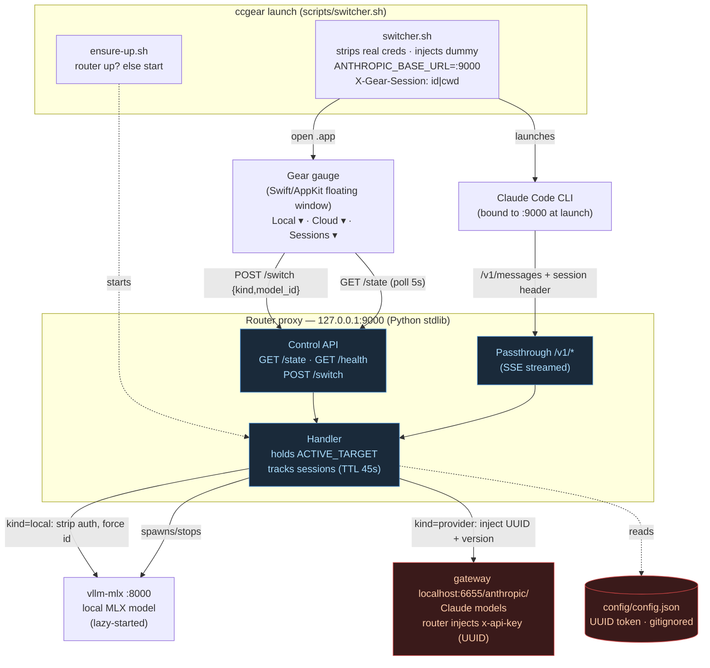
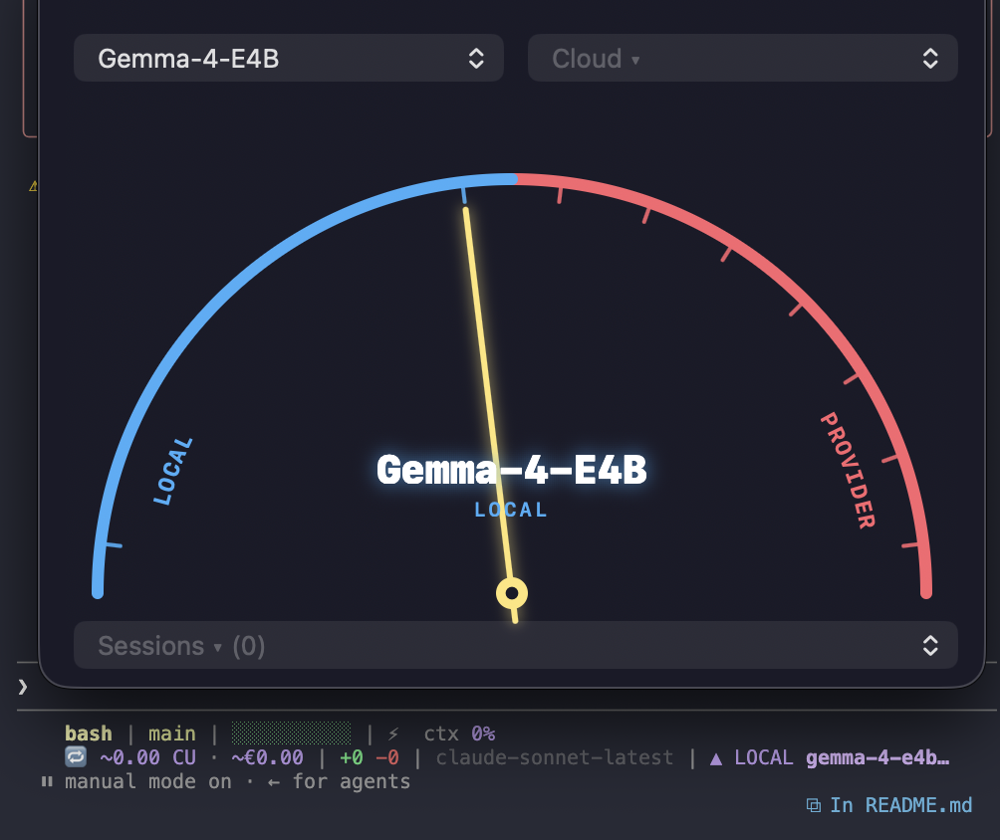

# switchable-llm-gear

A floating desktop gauge to hot-swap Claude Code's backend **mid-session** between
**local** LLMs (vllm-mlx on Apple Silicon) and **provider/cloud** Claude models —
without restarting the session or losing the conversation.

Pick a model from the gauge → a router proxy repoints the live session. No `/model`
restart, no relaunch.

```
        Local ▾              Cloud ▾          ← two dropdowns pick model per side
   ╭─────────────────────────────────────╮
   │        ╭───  L O C A L | C L O U D  ─╮ │  ← curved arc labels
   │      ╱      · · ·   |   · · ·      ╲   │  ← minimal ticks, one per model
   │     │        ╲      ↑      ╱        │  │  ← needle → active model
   │              GLM-4.7-Flash             │  ← big glowing center readout
   │                 LOCAL                  │
   ╰─────────────────────────────────────╯
```

## Why

Claude Code binds `ANTHROPIC_BASE_URL` + auth **once at launch** and never repoints
mid-session. Its `/model` command only flips Opus/Sonnet/Haiku *tiers* at one fixed
URL. To hot-swap the actual backend, Claude Code talks to a **fixed-URL router proxy**
that we control; the gauge tells the router which backend to forward to.

## Architecture



Claude Code is launched pointed at the router (`:9000`) and never sees the real
backends or the provider token — the router injects auth itself.

## Layout

```
switchable-llm-gear/
├── router/
│   ├── router.py            # proxy on :9000 — control API + Anthropic passthrough
│   └── catalog.json         # local + provider model catalog
├── scripts/
│   ├── serve-local.sh       # vllm-mlx serve invocation + readiness poll
│   ├── ensure-up.sh         # idempotent: start router if not already on :9000
│   └── switcher.sh          # front door: ensure router up, launch Claude routed at it
├── gear/
│   ├── src/GearApp.swift    # hand-coded AppKit gauge (no Xcode/SwiftUI)
│   ├── build.sh             # swiftc → build/Gear ; MAKE_APP=1 → build/Gear.app
│   └── build/               # gitignored build outputs
├── config/
│   ├── config.example.json  # committable template
│   └── config.json          # gitignored — holds the provider UUID token
├── run/                     # gitignored — state.json + router.log + vllm.log
└── .gitignore
```

## Setup

1. Copy the config template and fill in your gateway token:
   ```bash
   cp config/config.example.json config/config.json
   # edit config/config.json — set provider_auth_token, vllm_bin, hf_cache
   ```
   `config/config.json` is gitignored; the UUID token never gets committed.

2. Build the gauge:
   ```bash
   MAKE_APP=1 bash gear/build.sh      # → gear/build/Gear.app
   ```

## Usage

Once the `ccgear` alias is set up (see `RUN.md`), launch a routed session and the
gauge in one command:
```bash
ccgear                 # routes through the router + opens the gauge
```
`ccgear` brings the router up if needed, opens the floating gauge (unless already
running), and launches Claude Code pointed at the router. Plain `claude` stays a
normal, non-routed session.

<p align="center">
  
</p>

Then pick a model from the **Local** or **Cloud** dropdown — the needle sweeps to it
and the live session's backend switches. Switching to a local model lazy-starts
vllm-mlx (first switch can take ~10–60s while the model loads). The **Sessions ▾**
dropdown lists every routed session currently attached.

Suppress the gauge for one launch with `GEAR_NO_UI=1 ccgear` (router still routes).

<details>
<summary>Run the pieces manually</summary>

```bash
bash scripts/switcher.sh             # same as ccgear (the alias points here)
open gear/build/Gear.app             # gauge only
bash scripts/ensure-up.sh            # router only; idempotent, no-op if :9000 answers
```
</details>

## Router control API (localhost only)

| Method | Path      | Purpose                                                        |
|--------|-----------|----------------------------------------------------------------|
| GET    | `/state`  | active target + `vllm_up` + catalog (`local`, `local_installed`, `provider`) + attached `sessions[]` |
| POST   | `/switch` | `{kind:"local"\|"provider", model_id}` → repoint; local restarts vllm-mlx and waits for healthy |
| GET    | `/health` | router liveness                                                |
| *      | `/v1/*`   | Anthropic Messages passthrough to the active backend (SSE streamed) |

## Config keys (`config/config.json`)

| key | meaning |
|-----|---------|
| `provider_base_url` | gateway base, e.g. `http://localhost:6655/anthropic/` |
| `provider_auth_token` | gateway UUID — injected as `x-api-key`, never sent to Claude |
| `anthropic_version` | e.g. `2023-06-01` |
| `vllm_bin` | absolute path to `vllm-mlx` binary |
| `hf_cache` | HuggingFace cache dir (used to detect which local models are installed) |
| `vllm_port` | local backend port (default 8000) |
| `router_port` | router port (default 9000) |
| `default_target` | `{kind, model_id}` the router starts on |

## Session identity

Multiple Claude Code sessions share the one router → they share the active backend.
`scripts/switcher.sh` injects an `X-Gear-Session: <session_id>|<cwd>` header
(via `ANTHROPIC_CUSTOM_HEADERS`) on each request; the router tracks last-seen
sessions (pruned after 120s) and exposes them in `/state`, and the gauge shows the
attached session at the bottom.

## Notes / known limits

- Local switch keeps **one** model in RAM — switching local→local restarts vllm-mlx.
- Mid-conversation swap replays full history to the new backend each turn; handing a
  large Claude-shaped context to a small 4-bit local model may occasionally misparse.
- The switcher is **opt-in per launch** — no SessionStart auto-launch. Type `claude`
  for a normal session, or `ccgear` (alias → `scripts/switcher.sh`) for a routed
  session with the gauge (local + Claude switching). See `RUN.md`.
- macOS + Apple Silicon only. Swift built with Command Line Tools `swiftc` (no Xcode).
